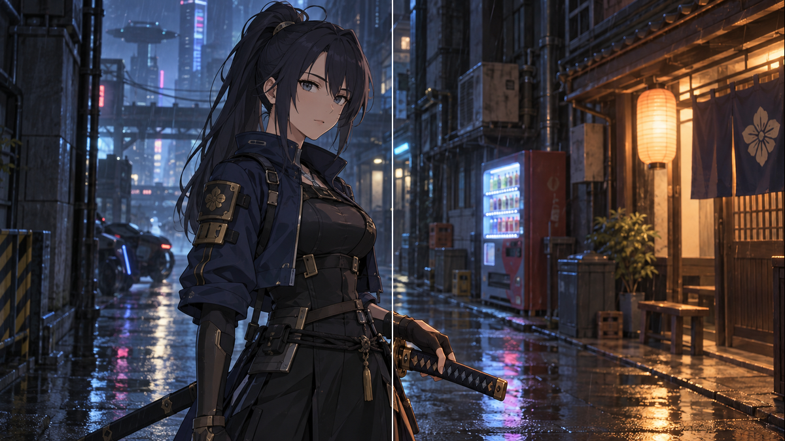

# DLSS5 Cinematic Remaster · v3

[中文完整说明](README.zh-CN.md)

A reusable AI-assistant skill for cinematic **relighting of existing anime, game, CG and photographic images**. It aims for visible atmosphere and dimensional shading while preserving identity/layout, source color intensity and crisp material boundaries. Each image receives a fresh brief; previous examples do not become scene or palette templates.

This package contains instructions, prompt recipes, review tooling and evidence. It contains no DLSS runtime/NVIDIA model and is not a realtime game/desktop filter.

## Modes and workflow

- **Normal:** clear, restrained form shading, material separation and highlight rolloff.
- **Deep:** conspicuous existing environmental light, stronger readable shadows and localized highlights. Deep increases lighting amplitude, retaining the same identity/layout and color protections.

The agent chooses and states the mode, inspects and freezes input roles/protected content, uses the real editor, then evaluates four independent gates: content/identity, visible lighting uplift, color restraint, clarity/light coherence. Up to two targeted corrections return to the original. A failed or qualified preview remains explicitly labeled; attractive lighting cannot offset a content failure.

v3 incorporates a dated review of **15 local related Skill entrypoints and 22 public entrypoints from 7 repositories**, with overlap and specialist exclusions disclosed. See [audit and source links](references/skill-audit.md) and [requirements traceability](references/requirements.md). This is a scoped review, not an exhaustive internet census or model training.

## v3 visual evidence

Source left, result right. Center wipes are presentation previews; full comparisons and native detail inspections inform assessment.


[Full ensemble comparison](assets/v3-ensemble-side-by-side.png). Qualified preview: stronger existing parchment/form lighting, more restrained orange/cobalt than v2, with fine-detail redraws and pending user color assessment.



[Full portrait comparison](assets/v3-portrait-side-by-side.png). Assistant visual pass: stronger existing lantern-side light/material response, no critical face/grip/layout change observed. User approval remains pending.

v3 adds two executions on two inputs. Together with v2 there are five executions on three distinct inputs, not five independent cases or five passes. Hidden model version/seed remain unknown, fine detail can drift, and real-person photo/temporal-video stability is untested. See [validation](references/validation-v3.md), [exact prompts](references/v3-test-prompts.json) and [results](references/v3-test-results.json). Complete workflow does not imply guaranteed image success.

## Install and invoke

```bash
git clone https://github.com/kaichunjun/dlss5-cinematic-remaster.git ~/.codex/skills/dlss5-cinematic-remaster
```

Windows PowerShell:

```powershell
git clone https://github.com/kaichunjun/dlss5-cinematic-remaster.git "$env:USERPROFILE\.codex\skills\dlss5-cinematic-remaster"
```

For an existing clean clone, use `git pull --ff-only` in that directory; preserve customizations first. Alternatively place the repository folder in the Skill directory. Restart Codex if needed. Attach your image:

```text
$dlss5-cinematic-remaster Use Deep: clearly stronger lighting and atmosphere, preserve identity/layout and source color intensity.
```

Specify Normal or let the agent infer the mode. The host needs a working image-edit tool; this text package is not a generation engine. Built-in editing is the default. Optional external pipelines require actual supported controls and the relevant user-selected route.

## Contents

- [SKILL.md](SKILL.md): compact execution entrypoint.
- [Recipes](references/prompt-recipes.md): source-based core, modes and targeted corrections.
- [Adapters](references/tool-adapters.md): real controls, media/batch/video boundaries.
- [Evaluation](references/evaluation.md): four gates, comparison helper usage and retained historical failures.
- [Review helper](scripts/review_artifact.py): optional Python 3.9+ and FFmpeg/ffprobe utility, comparisons/metadata only; never grades aesthetics.
- [Audit](references/skill-audit.md), [inventory](references/source-inventory.json), [validation](references/validation-v3.md): provenance, design decisions and evidence limits.
- [Runtime notes](references/runtime-controls.md): separate historical empirical community-app notes for explicit runtime requests, not authoritative or universal settings.

Self-authored workflow/prompt/script text is [MIT licensed](LICENSE); [image/source rights](NOTICE.md) remain with their owners.
