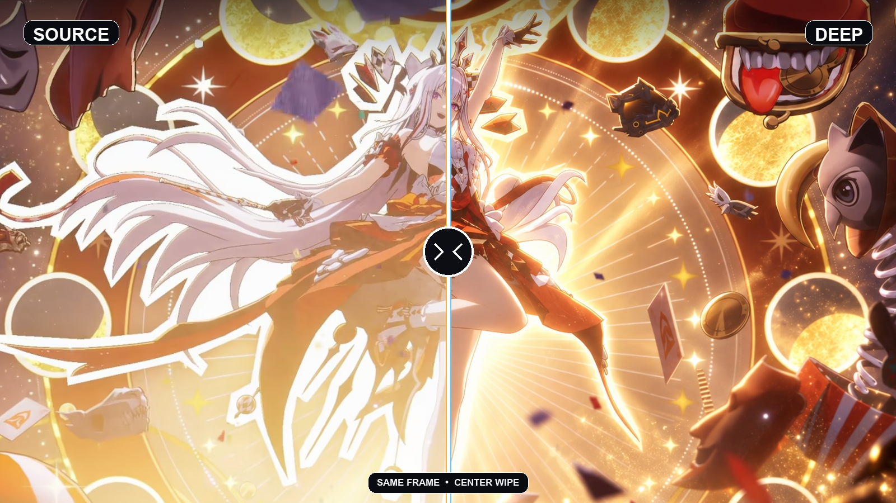
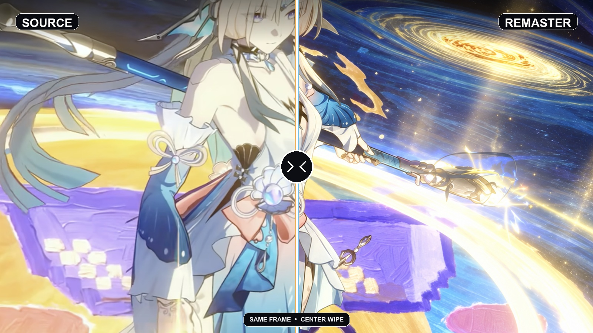
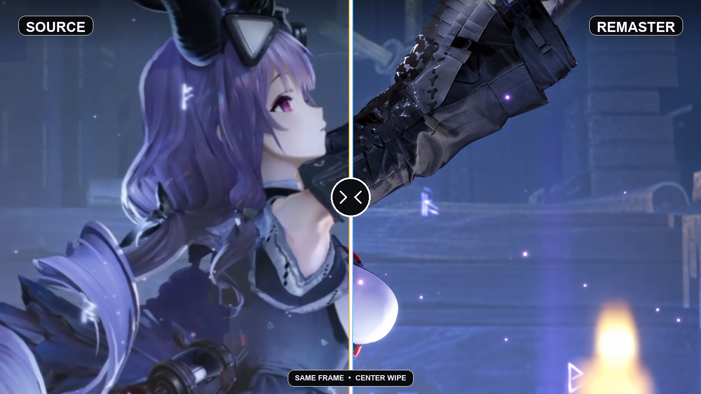
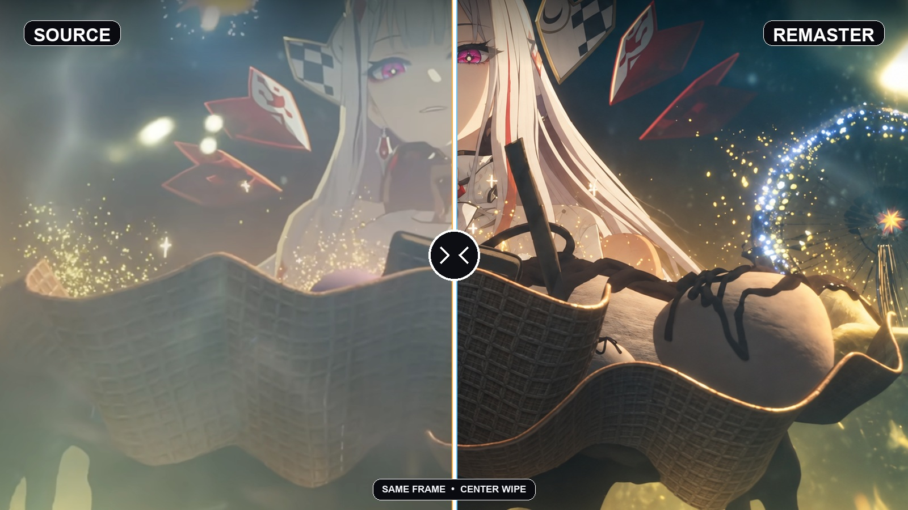
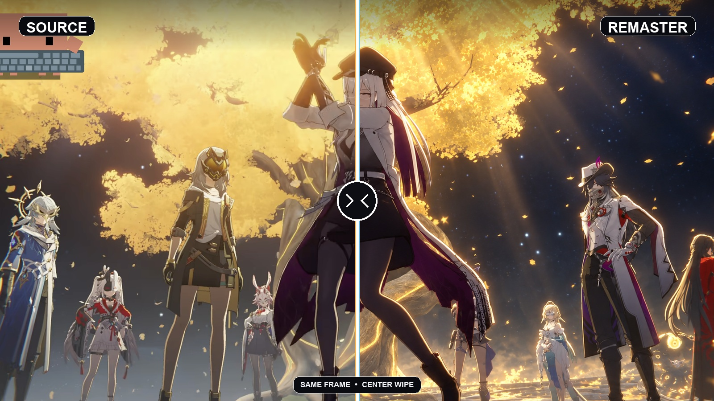

# DLSS5 电影级重绘 Skill

[English README](README.md)

**面向动漫、游戏与 CG 画面的结构感知型电影级神经重绘工作流。**

DLSS5 Cinematic Remaster 是一套可复用的 Codex Skill 与画面验收体系。它把高规格神经渲染常见的画质目标，拆解为可执行的材质分离、光照层级、空间纵深、高光过渡和局部结构控制；同时锁定人物身份、人体比例、服装结构、镜头、构图、颜色与原始美术方向。

它并非一句泛化的“增强画质”提示词，也不依靠锐化或固定滤镜制造表面清晰度。工作流会把画质提升与结构保真分别评估，主动检查身份漂移、水彩式涂抹、蜡感皮肤、全局油亮、过量泛光、锐化白边和凭空生成细节等常见问题。

系统提供两个生产档位：

- **Normal 正常档**：忠实、清楚、稳定，增强材质和层次，尽量少漂移。
- **Deep 深度档**：强化环境氛围、主角光、阴影、色彩分离和大片感，同时保护脸、手、服装与边缘。

它可以用于自然语言图片编辑器，也可以映射到 Flux／SDXL／ComfyUI 的 img2img 工作流，以及带有色调、结构、皮肤保护、强度、蒙版或处理遍数控制的神经渲染工具。仓库同时提供固定提示词架构、不同模型的适配方法、参数起点、可重复的画面验收标准和同画面前后对比案例。



*使用搭档提供的参考画面制作中央滑动式对比：左侧原图，右侧 Deep。*

## 它会做什么

Skill 会逐张分析图片，先判断 Normal 或 Deep，再锁定当前图里可见的人物身份、姿势、身体比例、服装结构、镜头、裁切、场景布局、物体、颜色和艺术风格。之后只重建材质响应、光线层次、接触阴影、反射、透光与高光过渡。

| 档位 | 适合 | 画面表现 |
|---|---|---|
| Normal | 人像、干净动漫图、UI／文字较多、忠实修复 | 中等局部对比、受控反射、材质清楚、暗部可读、漂移较少 |
| Deep | 戏剧化场景、主角镜头、强氛围、大片感、拉满 | 明确主光／补光／轮廓光、空间雾层、更深阴影、更强互补色分离 |

两个档位都会压制大范围降噪、蜡感皮肤、水彩式涂抹、全局油亮、锐化白边、死黑、爆高光、人体变化与凭空添加装饰。

### 全部案例对比

每张视觉参考都统一做成中央分割对比：左半边是搭档提供的原图，右半边是重绘结果。

#### 高光控制与宇宙纵深



#### 冷色材质纵深



#### 保留结构的环境光韵



#### 主角光与环境尺度



这些对比图限定的是可迁移的画质方向，并非固定人物或场景。每处理一张新图，Skill 都会重新分析人物、材质、颜色与光源。

## 安装

把仓库克隆到 Codex 的 Skill 目录：

```bash
git clone https://github.com/kaichunjun/dlss5-cinematic-remaster.git ~/.codex/skills/dlss5-cinematic-remaster
```

如果安装后没有立刻出现，重启一次 Codex。

## 使用

附上图片并调用：

```text
$dlss5-cinematic-remaster 重绘这张图，档位由你判断。
```

也可以直接指定：

```text
$dlss5-cinematic-remaster 用 Normal 正常档，保持原构图和人物身份。
```

```text
$dlss5-cinematic-remaster 用 Deep 深度档，氛围和帅感拉高，但不要糊掉细节。
```

生成前，Skill 会先说明选了哪个档。只有意图确实模糊、两个档位会明显改变结果时才询问。

## Neural Rendering 类工具参数起点

这些是起始值，需要用对比滑杆按素材微调：

| 档位 | Style | NR intensity | Local tone | Local structure | Skin structure | Passes |
|---|---|---:|---:|---:|---:|---:|
| Normal | Natural / Cinematic | 0.55–0.75 | 0.30–0.45 | 0.70–0.90 | -0.7 到 -0.3 | 1 |
| Deep | Cinematic | 0.80–1.00 | 0.45–0.65 | 0.80–1.00 | -0.5 到 0.0 | 1 |

优先提高网络处理分辨率，再增加 Local structure。默认只跑一遍；重复重建很容易让头发、布料、文字和背景边缘融成一片。

## 项目结构

```text
SKILL.md                    档位判断与完整执行规则
agents/openai.yaml          Codex 显示信息
references/prompt-recipes.md
references/evaluation.md    画面验收标准与测试记录
assets/                     统一中央分割的案例对比图库
```

## 范围说明

这是独立的提示词与工作流 Skill，**它不是 NVIDIA DLSS 软件**，不包含 NVIDIA 二进制文件或模型，也不能让本来不支持 DLSS 的游戏自动获得 DLSS。名称描述的是目标视觉方向；实际结果由你调用的图片编辑模型或渲染工具决定。

## 许可证

工作流、提示词与文档采用 MIT，见 [LICENSE](LICENSE)；示例图片权利说明见 [NOTICE.md](NOTICE.md)。
