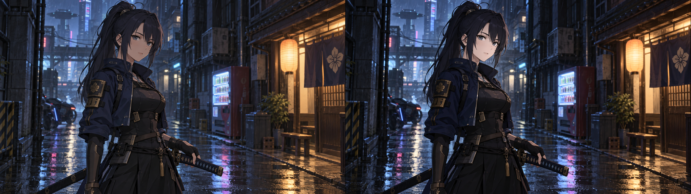

# 电影光感调色与局部光影 Skill · v4

[English](README.md)

**像手工 PS 一样，用曲线、局部蒙版、加深减淡和克制调色塑造光感。** AI 负责分析与执行，默认对原有像素做传统调整，沿用原图的脸、线条、纹样和构图。每张图单独设计调整层，继承方法而非套用示例人物或坐标。

保留历史调用名 `dlss5-cinematic-remaster`。DLSS5 指视觉灵感；本仓库没有 NVIDIA 模型／运行时，也没有 Windows 实时桌面过滤器。

## 正常／深度两档

| 档位 | 处理目标 |
|---|---|
| Normal 正常档 | 清楚、克制地增强形体明暗、材质分离与高光层次 |
| Deep 深度档 | 更明显的焦点受光、背光阴影、局部环境光与空间层次 |

两档都默认纯调整、原图色彩强度优先。深度档提高光影幅度；饱和度增强、全图模糊和生成式重绘均非默认。生成式重构只在明确要求时启用，工具缺失也会如实说明，避免悄悄换成重绘。

## v4 的实际对比

同一张雨夜图做传统调整，**左原图，右结果**：脸部受光更亮、背光衣袖更深，背景、发丝、表情和饰物沿用原件。下图是展示预览；完整原生尺寸图及细节另行检查。



[原图](assets/v4-portrait-source.png) · [中线划像对比](assets/v4-portrait-deep-center-wipe.png) · [原尺寸结果](assets/v4-portrait-deep-result.png) · [Normal 完整对比](assets/v4-portrait-normal-side-by-side.png)

新流程测试一个输入、两档和一次深度档复算，14 项计算检查通过；助手在该图上视觉验收通过，用户审美确认待定。没有宣称全题材稳定成功率。旧版生成对比见 [v3 历史记录](references/validation-v3.md)，它们无法证明新流程的效果。详见 [v4 验证](references/validation-v4.md)。

## 安装与调用

macOS／Linux：

```bash
git clone https://github.com/kaichunjun/dlss5-cinematic-remaster.git ~/.codex/skills/dlss5-cinematic-remaster
```

Windows PowerShell：

```powershell
git clone https://github.com/kaichunjun/dlss5-cinematic-remaster.git "$env:USERPROFILE\.codex\skills\dlss5-cinematic-remaster"
```

也可将仓库文件夹复制到 Skill 目录。已有干净克隆可 `git pull --ff-only`，更新前保留自己的修改；安装后若未出现，重启 Codex。附图调用：

```text
$dlss5-cinematic-remaster 深度档，纯调整：用曲线和局部蒙版做明显光感，保留原图线条、脸和纹样，色彩克制。
```

优先用宿主里实际可用的图像编辑器调整层；宿主无需图像生成模型。原生编辑器可以保留其支持的图层文件，连接器若仅给扁平图则明确标注。

本地备用工具需要 Python 3.9+、NumPy 和 Pillow，实际执行：

```bash
python scripts/apply_adjustments.py --source your-source.png --recipe your-image.json --output-dir grade-new
```

AI 按当前图片写 `your-image.json`；[示例配方](references/v4-portrait-deep.json)仅适用于这里的雨夜图。工具返回结果 PNG、逐层步骤、蒙版及可复算 JSON，**没有伪称 PSD 或独立 EXE**。支持单张 8-bit RGB/RGBA；16-bit/HDR 母版应在支持它的原生编辑器处理。原图保留，输出目录须为新目录。

## 文件与方法

- [SKILL.md](SKILL.md)：双档、纯调整默认路线、逐图分析与验收。
- [adjustment-workflow.md](references/adjustment-workflow.md)：Photoshop 调整层方法、本地配方语法与真实计算边界。
- [apply_adjustments.py](scripts/apply_adjustments.py)：确定性调整；无生成模型、几何重采样、修补或画面模糊。
- [tool-adapters.md](references/tool-adapters.md)：原生编辑器、连接器、批量／视频、显式生成路线。
- [requirements.md](references/requirements.md)、[evaluation.md](references/evaluation.md)：完整需求和四项验收。
- [review_artifact.py](scripts/review_artifact.py)：Python + FFmpeg/ffprobe，生成对比及原生细节裁切，保持母版；脚本不自动评画质。
- [skill-audit.md](references/skill-audit.md)：此前 Skill 调研与本轮方法修订；历史 [prompt-recipes.md](references/prompt-recipes.md)只给显式生成请求使用。

光感由现有像素的明暗／色彩关系塑造；真实三维光照与缺失纹理没有因此重建。蒙版与强度仍需逐图设计。自写文档与脚本使用 [MIT License](LICENSE)，第三方示例权利说明见 [NOTICE.md](NOTICE.md)。

复算仓库中的深度档示例（已包含原图与配方）：

```bash
python scripts/apply_adjustments.py --source assets/v4-portrait-source.png --recipe references/v4-portrait-deep.json --output-dir portrait-deep-demo
```
